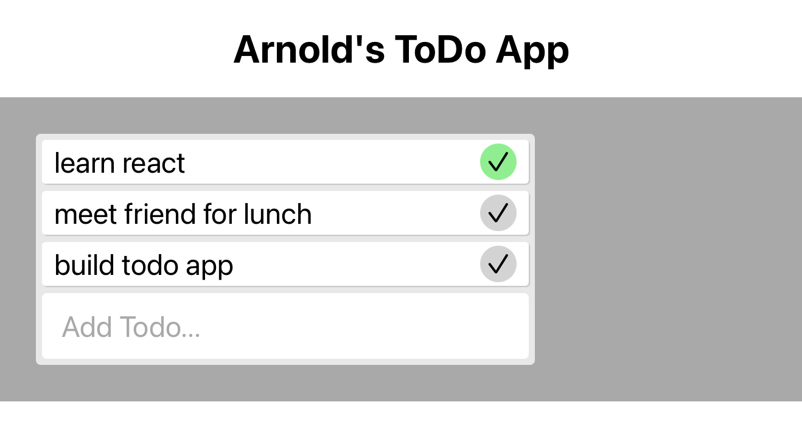

# TODO-LIST-Exercise
MITxPRO Week 14 Exercise - Working with Lists in React

## Description
This To-Do app auto populates with a list of items to be done. Items can be added in the bottom input field and can be removed by clicking the check mark next to the item once it is completed. This project's focus was on the CRUD model and how to implement this into a website using React and the DOM.

## How to run
Download all of the files to the same directory, making sure to keep the same file structure in place. Load the index.html file in a browser to start the program. The auto-populated to-do items can be removed and new items can be added.

## Future Improvements
Future improvements could be to have a list of completed items or different subcategories to better organize to-do items.

## Licence Info
Code written by Arnold Schaefer using starter code from the MITxPRO full stack development bootcamp course.
